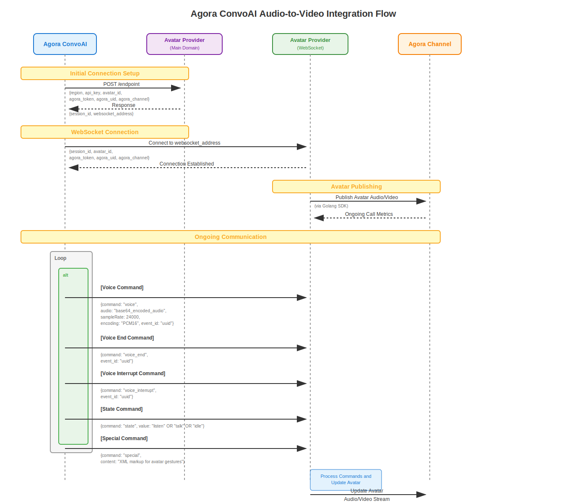

# Agora ConvoAI Audio-to-Video Integration

This repository provides a generic protocol and implementation for external services to receive audio output from Agora's ConvoAI platform, enabling real-time generation and publishing of audio and video content back into Agora channels. This creates interactive experiences such as AI-powered avatars, interactive movies, and other real-time multimedia applications.

## Overview

The integration follows a three-phase workflow:

1. **Connection Setup** - Establish session and obtain WebSocket connection details
2. **Audio Streaming** - Receive real-time audio data from ConvoAI via WebSocket
3. **Video Publishing** - Generate and publish audio/video content back to Agora channel

## Architecture Flow

## Implementation Components

### 1. Connection Setup API
[📁 connection-setup/](./connection-setup/)

### 2. WebSocket Audio Streaming
[📁 websocket-receive-audio/](./websocket-receive-audio/)

### 3. Go Audio/Video Publishing
[📁 go-publish-audio-video/](./go-publish-audio-video/)

## Use Cases

**Interactive AI Avatars**
- Virtual assistants and customer service representatives with lifelike appearance
- AI tutors and language learning companions for personalized education
- Brand mascots and virtual receptionists for business applications

**Dynamic Content Creation**
- Interactive movies and choose-your-own-adventure experiences that adapt to viewer input
- Automated video hosts for news, podcasts, and live streaming
- AI-powered social media influencers and content creators

**Real-time Visualization**
- Architectural design consultations with live 3D building and interior visualizations
- Scientific simulations showing molecular interactions, physics concepts, and biological processes
- Technical documentation with animated software tutorials and engineering process demonstrations

**Educational & Training Applications**
- Historical recreations and mathematical concept visualization
- Medical procedure training with anatomical models and surgical simulations
- Emergency response and manufacturing process training scenarios

**Creative & Analytical Presentation**
- Data visualization for financial analysis, weather forecasting, and business intelligence
- Art instruction with real-time painting demonstrations and music composition visualization
- Virtual real estate tours and travel experiences with immersive environments

This system transforms any descriptive AI output into corresponding visual content in real-time, making it versatile for applications where visual understanding enhances spoken explanations.